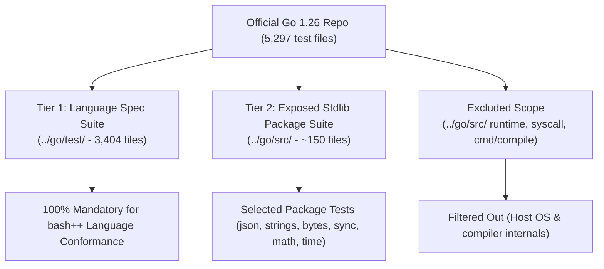
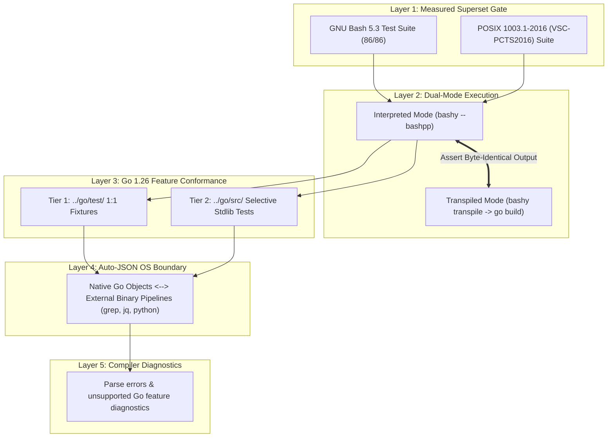

# Plan: bash++ Conformance & Testing Framework (Go 1.26 + POSIX 1003.1-2016 + GNU Bash 5.3)

**Target Standards & Versions:**
- **Go Version:** Go 1.26 (`go1.26`)
- **POSIX Version:** IEEE Std 1003.1-2016 / VSC-PCTS2016 Shell Standard (`POSIX08` profile)
- **GNU Bash Version:** GNU Bash 5.3 (86/86 fixture suite)

**Headline Claim Target:**  
`bashy` — a pure-Go Bash 5.3 drop-in + **Go 1.26 compliant/conformant** `bash++` extensions, validated against **POSIX 1003.1-2016**.

---

## 1. Test Scope Strategy: Tier 1 (Language Spec) vs Tier 2 (Stdlib)

To achieve 1:1 Go 1.26 compliance efficiently, we divide the Go 1.26 test suite into 2 tiers:



### Tier 1 (Mandatory - Language Spec Suite):
- **Source:** `../go/test/` (3,404 `.go` test files).
- **Scope:** 100% inclusion. Tests language syntax, AST evaluation, control flow (`for`, `if`, `switch`, `range`, `defer`), data structures (`struct`, `map`, `slice`, `interface`), concurrency (`go routine`, `chan`, `select`), `clear()`, and diagnostic error checks (`// errorcheck`).
- **Goal:** Proves 1:1 language specification fidelity.

### Tier 2 (Selective - Exposed Standard Library Packages):
- **Source:** `../go/src/` (~150 `*_test.go` files).
- **Included Packages:** `encoding/json`, `strings`, `bytes`, `sync`, `math`, `time`.
- **Goal:** Validates packages exposed to `bash++` scripts via builtins, auto-JSON process boundaries, and the Go reflect bridge.

### Excluded Scope:
- **Source:** `../go/src/runtime/`, `syscall/`, `cmd/compile/`, `go/types/`, assembly files.
- **Rationale:** Internal Go runtime/compiler implementation details. `bashy` runs on top of the host Go runtime and does not reimplement low-level OS kernel interfaces or assembly syscalls.

---

## 2. Five-Layer Testing Methodology



---

## 3. Go 1.26 & POSIX Mapping Matrix

| Test Category | Source Location | bash++ Target Feature | Execution Mode |
|---|---|---|---|
| **POSIX 1003.1-2016 Baseline** | VSC-PCTS2016 / `posix` scenario | POSIX shell non-regression | `bashy --posix --bashpp` |
| **GNU Bash 5.3 Baseline** | `bashy` 86-fixture suite | Bash 5.3 non-regression | `bashy --bashpp` |
| **Tier 1: Go Language Spec** | `../go/test/` (3,404 files) | `for`, `if`, `chan`, `select`, `defer`, `clear()` | `bashy --bashpp` & `transpile` |
| **Tier 2: Stdlib Integration** | `../go/src/` (`encoding/json`, `strings`, `sync`) | Go bridge & Auto-JSON OS boundary | `bashy --bashpp` |
| **Diagnostics** | `../go/test/cannotassign.go`, `assign.go` | Parsing/compile error diagnostics | `bashy --bashpp` |

---

## 4. Harness Automation (`harness/run.sh`)

The test runner enforces dual-mode execution (Interpreted vs Transpiled) across all Tier 1 and Tier 2 tests:

```bash
#!/usr/bin/env bash
# Dual-mode bash++ runner

set -euo pipefail

run_dual_test() {
  local test_file="$1"
  
  # 1. Run Interpreted
  bashy --bashpp "${test_file}" > /tmp/interp.out 2>&1
  local interp_status=$?

  # 2. Transpile and Compile Native
  bashy transpile "${test_file}" -o /tmp/test.go
  go build -o /tmp/test_bin /tmp/test.go
  /tmp/test_bin > /tmp/transpiled.out 2>&1
  local trans_status=$?

  # 3. Assert Identical Output and Exit Code
  diff /tmp/interp.out /tmp/transpiled.out
  test "${interp_status}" -eq "${trans_status}"
}
```

---

## 5. Documentation & Claim Governance

Once `bashpp-tests` validation passes across Tier 1 and Tier 2, update `bashy/README.md`:

```markdown
# bashy — a pure-Go Bash 5.3 drop-in & Go 1.26 compliant shell

`bashy` is a single static binary that runs Bash scripts and interactive sessions.
It is a **drop-in replacement for GNU Bash 5.3** (100% test suite pass rate: 86/86),
conforms to **POSIX 1003.1-2016** (IEEE Std 1003.1-2016), and provides **Go 1.26 compliant/conformant**
`bash++` extensions.
```
